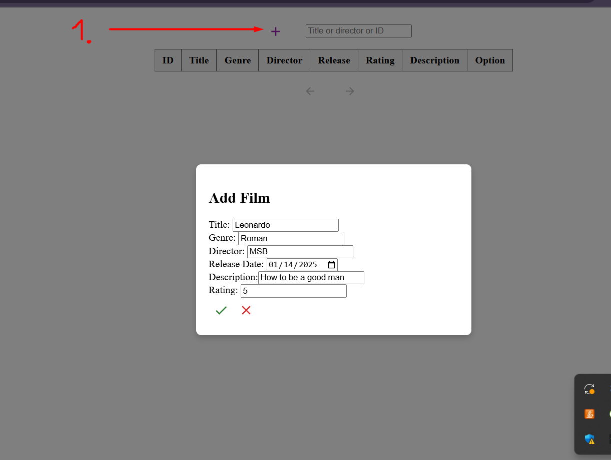
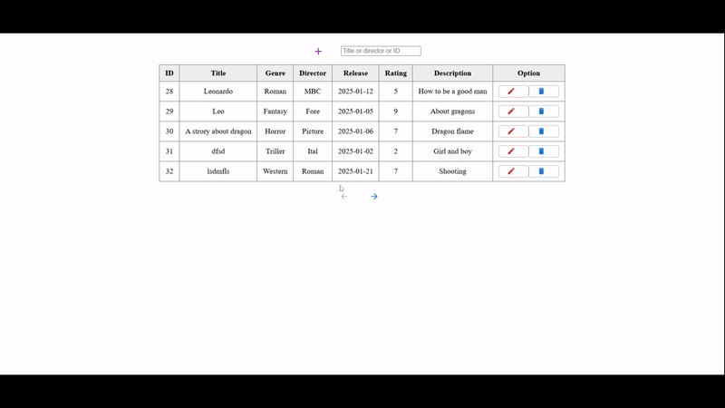

# FilmManagementService

## Movie Management System 🎥

A simple CRUD app for managing movies built with .NET Core and React.  
Users can view, add, edit, and delete movies, as well as perform sorting, filtering, and searching.

- **Backend**: ASP.NET Core (Minimal API) + EF Core + MediatR 
- **Architecture**: Clean Architecture + Vertical Slice Architecture
- **Frontend**: React + Vite
- **Database**: Postgres
- **Testing**: Unit tests with the xUnit library, using an in-memory database for mocks
- **Docs**: Swagger UI

---

## Versions
>*Backend*: .NET 9 (SDK .NET 9)

>*Frontend*: React 18.3.1

## Installation

**Clone the Git repository**:  
 **>** `git clone https://github.com/Kozirojka/FilmManagementService-Minimum.git`

### Backend

1. Go to the server folder and restore packages and dependencies   
**>** `dotnet restore`.

2. Provide your connection string in the appsettings.json or in a password manager

3. Execute the EF migrations  
**>** `dotnet ef database update`

4. Run the backend:
   Your backend should be running at https://localhost:7091.

---

### Frontend

1. Navigate to the client folder FilmMS-Client

2. Install dependencies with command  
**>** `npm install`

3. Run server  
**>** `npm run dev`

Your frontend should be running at
http://localhost:5173

## How to Use the Application

1. Open modal window for adding film when you press on PLUS

2. Possibility to edit and delete

3. Pagination (.GIF)

4. Possibility filter by "Director" or "Title"  
(work with data that fetched from the server)

5. When we enter film ID in this field, it send a request to the server.  
As responce we receive information about the film with this ID

6. When we try to enter invalid data in "Rating" or   something not allowed in inputs, we receive an error (.GIF)  

7. Possibility to delete the film